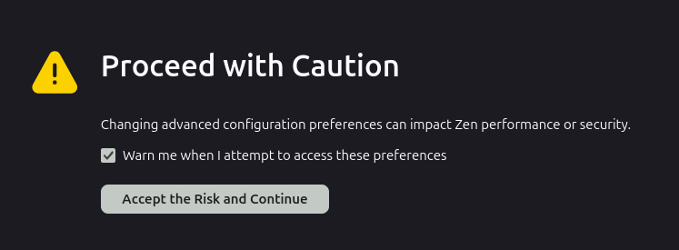
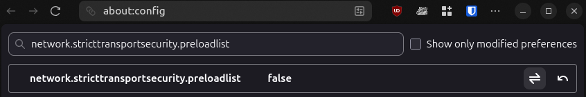
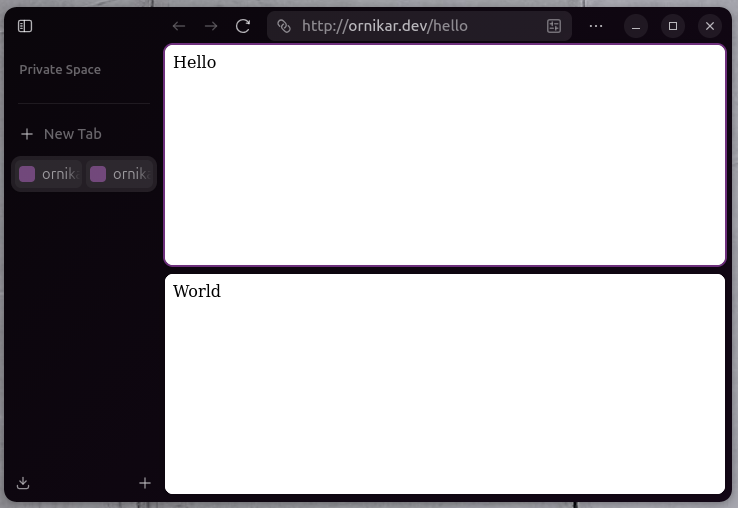

<div align="center">
  <h1>Hell/World deployement instructions</h1>
</div>

## Introduction
This is the final stage; deploying the applications in the actual kubernetes cluster and test that everything works as expected.

## Prerequisites

### Disable HSTS
**🚨 This step is mandatory else you won't be able to access the applications !🚨**

The `ornikar.dev` is protected by an [HTTP Strict Transport Security preload](https://hstspreload.org/?domain=ornikar.dev) mechanism to prevent users from protocol downgrade and other attacks.

In order to resolve http://ornikar.dev running locally you have to update a security setting from your browser.

👉 Not doing this will only allow interacting with the sites from the CLI (e.g. using curl or wget)

#### Firefox
💡 Tip: This also applies to any Firefox based browser, such as [zen-browser](https://github.com/zen-browser/desktop).

- In a new tab, go to `about:config`
- You may be prompted by a warning pop-up, click on "Accept the risk and Continue"

- Then enter `network.stricttransportsecurity.preloadlist` and switch the parameter to `false`

- You should be good to go (restart your browser if the SSL redirection continue to happen)

### Make sure the images are available in Minikube
Check using `minikube image list`, the command should yield something like the following.

```bash
$ minikube image list
...
docker.io/library/cloud-interview-world:latest
docker.io/library/cloud-interview-hello:latest
```

If they are missing but available in docker locally (check with `docker images`), you must redo the final step [to load the images to minikube registry](./2-apps-containerization.md#pushing-the-apps-to-minikube)

## Deploy the packaged applications
You are now good to go, to deploy tehm using default values run the following commands.

```bash
# Deploy the hello app in its own namespace
helm upgrade --install hello helm/charts/hello --create-namespace -n hello

# Deploy the world app in its own namespace
helm upgrade --install world helm/charts/world --create-namespace -n world
```
👉 Check the chart's READMEs for more customization

## Final check
Now in a firefox window where HSTS preload is disabled, open [hello](http://ornikar.dev/hello) and [world](http://ornikar.dev/world)

Here is the expected result
