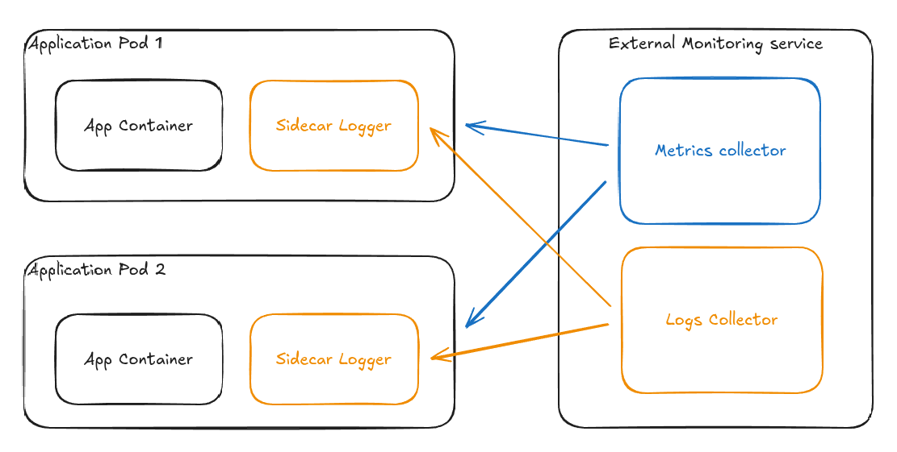

  <h1>Evolution proposal</h1>

# Context
Now that the applications are deployed and runnning, it's time to think about resiliency and how security can be improved.

# Containerization
The [hello](../apps/hello/README.md) app consist of a simple JavaScript app without packaging. This could change overtime as teams start to work with frontend tool systems such as Vite which provides [building for production](https://vite.dev/guide/build#building-for-production) capabilities.

In that case the first multi stage build would leverage Vite's building to production to generate a `dist` folder full of minified code to reduce retro engineering that could be served from a bucket (or a pod with a reverse proxy serving the `dist` proxy content if buckets are out of the equation) through a [CDN](https://www.cloudflare.com/learning/cdn/what-is-a-cdn/) for effective caching accross regions.

# Packaging
I packaged both applications to be independent because they may evolve in the future, but it might be a good thing to also consider abstraction and declaring a unique chart like `simple-web-deployment` declaring all the kubernetes CRD used in the cluster to deploy such applications.

# Log collection
## Application scpecific
I noticed the [hello](../apps/hello/README.md) app uses winston to log messages, the first thing that comes to mind would be to setup a production transport targeting a log collection service such as Datadog (a full list can be [found in their wiki](https://github.com/winstonjs/winston/blob/3.2.1/docs/transports.md)).

The same applies for the [world](../apps/world/README.md) app which uses PHP's Monolog package to handle logging, [additional handlers](https://github.com/Seldaek/monolog/wiki/Third-Party-Packages#handlers) can be setup to redirect logging to a centralized target.

## More generic approach
While the proposal above works, it requires developper teams to be aware of the logging collection process and implementation in their code.
Also not every logging collection has the desired data collector provider/handler available.

A more generic approach would be to request developper temas to use [structured logging](https://sematext.com/glossary/structured-logging/) in their code (local dev would output a pretty log message, but production outputs would be a delightful JSON format.) and implement a sidecar logging pattern in the deployment process.

This gives back control to the deployment team over the logging collection and abstract this process for the development team (and reduce the risk of secret sharing depending on how the app/deployment repositories are setup).

Moreover external monitoring services (such as the [Prometheus stack](https://prometheus.io/)) also provides metrics collection, so this would be easier to maintain as it centralizes monitoring.

⚠️ Beware of SPOF and fan out logging and metrics collection if possible (and not too costly)

# Tracing
This is an important thing to have to troubleshoot complex distributed and performance issues.
Depending on the budget and the stack I would add [Jaeger](https://www.jaegertracing.io/) which integrates well with prometheus and Grafana.

Another option would be to use [Sentry](https://docs.sentry.io/) which provides e2e tracing accross services (front/back/DB), identify slow queries and breaks them down and provides frontend replay crash to allow development teams to tackle issue with more context (although a little bit of setup is required on the deployment part to prevent CORS request blocking when sending events). It is also compatible with a lot of popular frameworks.

Using a challenger like [Highlight](https://github.com/highlight/highlight) could be also a good thing to cut costs or pluralize solutions.

# Bot protection
With GenAI bots are becoming increasly aggresive when it comes to scraping web pages, which could result in more CPU and network expanse from the company. And degrade the service for the user.

A good protection would be to add an AI firewall such as [Anubis](https://github.com/TecharoHQ/anubis) which is opensource, or use [Cloudflare's Bot Management](https://www.cloudflare.com/application-services/products/bot-management/)

# Threat management
Another consideration to reduce threats and improve the system performance (such as CPU profiling) would be to consider [eBPF tracing tools](https://www.brendangregg.com/ebpf.html) to monitor kernel events or network calls.

This could be done by deploying [cilium](https://cilium.io/) or [pixie](https://docs.px.dev/) in the cluster.